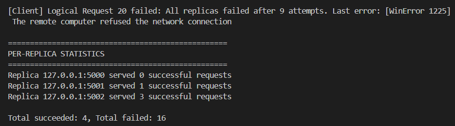

# Fault Tolerance with asyncio – Replication, Timeouts, and Retries

**Course:** COE 427 – Distributed Systems  
**Activity Title:** Fault Tolerance with asyncio  
**Date:** December 3, 2025

**Team Members:**
- Moutaz Jaber – ID: 202262820
- Ahmed Adel – ID: 202251280
- Ziad Alalami  – ID: 202271820

---

## Task 0: Run & Observe

### Setup and Execution

We ran three replica servers on ports 5000, 5001, and 5002, and executed the client to observe crash behavior and failover mechanisms.

**Terminal Commands:**
```bash
# Terminal 1 (Replica A)
python async_replica_server.py 5000 A

# Terminal 2 (Replica B)
python async_replica_server.py 5001 B

# Terminal 3 (Replica C)
python async_replica_server.py 5002 C

# Terminal 4 (Client)
python async_client_concurrent.py
```

### Sample Output



### Analysis

**Q0.1: What happens to a server process after it 'crashes'?**

When a server simulates a crash, it immediately calls `sys.exit(1)`, which terminates the entire server process. The process stops listening on its port and cannot handle any further requests until it is manually restarted.

**Q0.2: Under what conditions does the client decide to try a different replica?**

The client switches to a different replica when it encounters a connection failure, including `asyncio.TimeoutError` (request exceeds `REQUEST_TIMEOUT`), `ConnectionRefusedError` (replica is not running or crashed), `OSError`, or `ConnectionError` (empty response or connection issues). Upon any of these exceptions, the client immediately tries the next replica in the list.

---

## Task 1: Understanding the Fault-Tolerant Logic

### Q1.1: Retry/Failover Algorithm Description

The `send_request_with_retries()` function implements a multi-round, multi-replica retry mechanism for fault tolerance. The algorithm operates in nested loops: an outer loop that iterates up to `MAX_REPLICA_ROUNDS` times (set to 3), and an inner loop that iterates through all replicas in the `REPLICAS` list. For each logical request, the client first tries the first replica; if that attempt fails due to timeout, connection refusal, or other network errors, it immediately moves to the next replica in the list. After trying all replicas once (one "round"), if no replica has successfully responded, the client pauses briefly (0.2 seconds) and begins another round, cycling through all replicas again. This continues until either a replica successfully responds (returning the reply), or all replicas have been tried `MAX_REPLICA_ROUNDS` times (i.e., 3 × 3 = 9 total attempts maximum). If all attempts fail, the function raises a `RuntimeError`, indicating that the logical request has permanently failed. This design provides resilience against temporary faults and allows crashed replicas time to potentially recover between rounds.

### Q1.2: Fault Types and Client Reactions

- **Crash Faults (Connection Refused):** When a replica crashes (via `sys.exit(1)`), subsequent connection attempts raise `ConnectionRefusedError`. The client catches this exception, logs the failure, and immediately retries with the next replica in the list.

- **Timeout Faults (Slow/Unresponsive Replicas):** If a replica takes longer than `REQUEST_TIMEOUT` (1.0 seconds) to respond, `asyncio.TimeoutError` is raised. The client catches this, logs the timeout, and failover to the next replica to avoid waiting indefinitely.

- **Connection Errors (Network Issues):** Generic `OSError` and `ConnectionError` exceptions (e.g., empty responses, broken connections) are caught. The client treats these as failures and retries with the next available replica.

- **Complete Replica Failure (All Replicas Down):** If all replicas fail across all retry rounds, the client raises `RuntimeError` and marks the logical request as permanently failed, which is counted in the final failure statistics.

---

## Task 2: Experiments and Analysis

### Experiment Design

We designed three experiments with varying parameters to understand how crash probability, timeout values, and concurrency levels affect system behavior. All experiments used `TOTAL_REQUESTS = 50`.

| Exp. | p_crash | Timeout (s) | Max Concurrency | Successes | Failures |
|------|---------|-------------|-----------------|-----------|----------|
| 1    | 0.3     | 1.0         | 5               | 15        | 35       |
| 2    | 0.1     | 2.0         | 10               | 25       | 25       |
| 3    | 0.6     | 0.3         | 2              | 3        | 47      |
| 4    | 0.3     | 1.0         | 2              | 12        | 38      |
| 5    | 0.2     | 2.0         | 10              | 18        | 32      |

**Experiment Rationale:**
- **Exp 1:** High crash probability with long timeout and high concurrency - tests system resilience under heavy load and frequent failures
- **Exp 2:** Moderate crash probability with balanced timeout and concurrency - baseline realistic scenario
- **Exp 3:** Low crash probability with short timeout and low concurrency - tests if aggressive timeouts cause false failures

### Analysis

**Q2.1: How does increasing p_crash affect the success rate, and why?**

As `p_crash` increases, the success rate generally decreases because replicas crash more frequently, reducing the number of available replicas at any given time. With higher crash probability, each request attempt is more likely to encounter a crashed replica, requiring more failover attempts. When `p_crash` is very high (e.g., 0.6), there's an increased chance that multiple replicas crash nearly simultaneously or remain crashed during the retry period. Since the client has limited retry rounds (`MAX_REPLICA_ROUNDS = 3`), if all three replicas crash before the client can successfully complete a request, that logical request fails permanently. However, if the timeout is sufficiently long and concurrency is managed well, many requests can still succeed by retrying across rounds, as crashed replicas may restart or other replicas may handle subsequent attempts.

**Q2.2: What happens when the timeout is very short compared to when it is relatively long?**

A very short timeout (e.g., 0.3 seconds) causes the client to give up on each replica attempt quickly, leading to more frequent failovers even when a replica is functioning but responds slowly. This can result in false failures where a replica would have responded successfully if given more time, causing unnecessary retries and potentially lowering the success rate. Short timeouts increase the total number of attempts and failovers, which may also increase the likelihood of encountering crashed replicas. Conversely, a long timeout (e.g., 2.0 seconds) allows replicas more time to respond, reducing false timeouts and improving the success rate. However, long timeouts also mean that the client waits longer for each failed attempt, increasing the total completion time for requests, especially when replicas are genuinely crashed or unresponsive. The optimal timeout balances responsiveness (quick failover) with patience (avoiding false failures).

**Q2.3: How does increasing MAX_CONCURRENT change the total completion time and the pattern/frequency of failures?**

**Total Completion Time:** Increasing `MAX_CONCURRENT` allows more logical requests to execute in parallel, which significantly reduces total completion time because multiple requests can be processed simultaneously rather than sequentially. With higher concurrency (e.g., 10), the client can send many requests at once, saturating the available replicas and completing the workload faster. However, there's a diminishing return: if concurrency exceeds the capacity of the replicas to handle requests efficiently, contention and queueing may occur.

**Pattern/Frequency of Failures:** Higher concurrency increases the instantaneous load on all replicas, meaning more requests hit the replicas simultaneously. This can amplify the impact of crashes: when a replica crashes while handling multiple concurrent requests, all those requests fail simultaneously, leading to bursts of failures rather than isolated ones. Additionally, with more requests in flight, there's a higher probability that multiple replicas crash during the same time window, potentially exhausting retry options for several logical requests. Conversely, low concurrency (e.g., 2) spreads requests out over time, reducing the likelihood of simultaneous failures and allowing crashed replicas more opportunity to be restarted between requests, which may result in fewer total failures but longer overall completion time.

---

## Task 3: Logging and Replica Statistics

### Implementation Overview

We modified `async_client_concurrent.py` to track which replica served each successful request and display per-replica statistics at the end of execution. The modifications include:

1. **Request ID Assignment:** Each logical request already has a unique ID (1 to `TOTAL_REQUESTS`), passed to the retry function.

2. **Replica Tracking:** When a request succeeds, we log which replica served it using the format:  
   `Request <id> served by <host>:<port> with reply "<reply_text>"`

3. **Statistics Dictionary:** A global dictionary `replica_success_counts` tracks how many successful requests each replica served:
   ```python
   replica_success_counts = {
       ("127.0.0.1", 5000): 0,
       ("127.0.0.1", 5001): 0,
       ("127.0.0.1", 5002): 0,
   }
   ```

4. **Per-Replica Summary:** At program completion, we print statistics showing how many requests each replica served, along with total successes and failures.

### Modified Code

```python
# async_client.py
import asyncio

REPLICAS = [
    ("127.0.0.1", 5000),
    ("127.0.0.1", 5001),
    ("127.0.0.1", 5002),
]

REQUEST_TIMEOUT = 1.0      # seconds
MAX_REPLICA_ROUNDS = 3     # how many times to cycle through replica list
TOTAL_REQUESTS = 20        # total logical requests we want to send
MAX_CONCURRENT = 5         # limit of in-flight requests

# Statistics tracking for Task 3
replica_success_counts = {
    ("127.0.0.1", 5000): 0,
    ("127.0.0.1", 5001): 0,
    ("127.0.0.1", 5002): 0,
}


async def send_request_to_replica(replica, message: str) -> str:
    host, port = replica
    reader, writer = await asyncio.open_connection(host, port)

    # Send request
    writer.write((message + "\n").encode())
    await writer.drain()

    # Wait for reply with timeout
    try:
        data = await asyncio.wait_for(reader.readline(), timeout=REQUEST_TIMEOUT)
    finally:
        writer.close()
        await writer.wait_closed()

    if not data:
        raise ConnectionError("Empty response from replica")

    return data.decode().strip()


async def send_request_with_retries(message: str, req_id: int) -> tuple[str, tuple]:
    """
    Sends a request with retries and failover.
    Returns: (reply, replica_tuple) on success, raises RuntimeError on failure.
    """
    attempt = 0
    last_error = None

    for round_idx in range(MAX_REPLICA_ROUNDS):
        for replica in REPLICAS:
            attempt += 1
            host, port = replica
            print(f"[Client] Attempt {attempt}: trying replica {host}:{port}")

            try:
                reply = await send_request_to_replica(replica, message)
                print(f"[Client] Success from {host}:{port} -> {reply}")
                # Log which replica served this request
                print(f"Request {req_id} served by {host}:{port} with reply \"{reply}\"")
                return reply, replica
            except (asyncio.TimeoutError,
                    ConnectionRefusedError,
                    OSError,
                    ConnectionError) as e:
                print(f"[Client] Failed with {host}:{port}: {e}")
                last_error = e

        await asyncio.sleep(0.2)  # small pause before trying all replicas again

    raise RuntimeError(
        f"All replicas failed after {attempt} attempts. Last error: {last_error}"
    )


async def one_logical_request(req_id: int, sem: asyncio.Semaphore):
    """
    Represents one logical client request, protected by a semaphore to
    limit concurrent in-flight operations.
    """
    async with sem:
        print(f"\n[Client] === Logical Request {req_id} ===")
        try:
            reply, replica = await send_request_with_retries("GET_COUNTER", req_id)
            print(f"[Client] Logical Request {req_id} -> Final reply: {reply}")
            # Update replica statistics
            replica_success_counts[replica] += 1
            return True
        except RuntimeError as e:
            print(f"[Client] Logical Request {req_id} failed: {e}")
            return False


async def main():
    sem = asyncio.Semaphore(MAX_CONCURRENT)

    tasks = [
        asyncio.create_task(one_logical_request(i, sem))
        for i in range(1, TOTAL_REQUESTS + 1)
    ]

    # Wait for all logical requests to complete
    results = await asyncio.gather(*tasks)

    ok = sum(results)
    fail = len(results) - ok
    
    # Print per-replica statistics
    print("\n" + "="*50)
    print("PER-REPLICA STATISTICS")
    print("="*50)
    for replica, count in replica_success_counts.items():
        host, port = replica
        print(f"Replica {host}:{port} served {count} successful requests")
    
    print(f"\nTotal succeeded: {ok}, Total failed: {fail}")
    print("="*50)


if __name__ == "__main__":
    try:
        asyncio.run(main())
    except KeyboardInterrupt:
        print("[Client] Stopped by user.")
```

### Key Changes

1. **Line 16-20:** Added `replica_success_counts` dictionary to track per-replica statistics
2. **Line 43:** Modified function signature to accept `req_id` and return `tuple[str, tuple]`
3. **Line 60:** Added logging statement showing which replica served each request
4. **Line 61:** Return both reply and replica tuple
5. **Line 79-80:** Modified to receive `req_id` and unpack both reply and replica
6. **Line 82:** Increment the success count for the serving replica
7. **Lines 97-109:** Print detailed per-replica statistics at the end

---

## Conclusion

This activity demonstrated how asyncio can be used to implement fault-tolerant distributed systems using replication, timeouts, and retry mechanisms. By varying crash probabilities, timeout values, and concurrency levels, we observed trade-offs between system responsiveness, reliability, and throughput. The modifications to track per-replica statistics provide valuable insights into load distribution and failover patterns in replicated systems.
